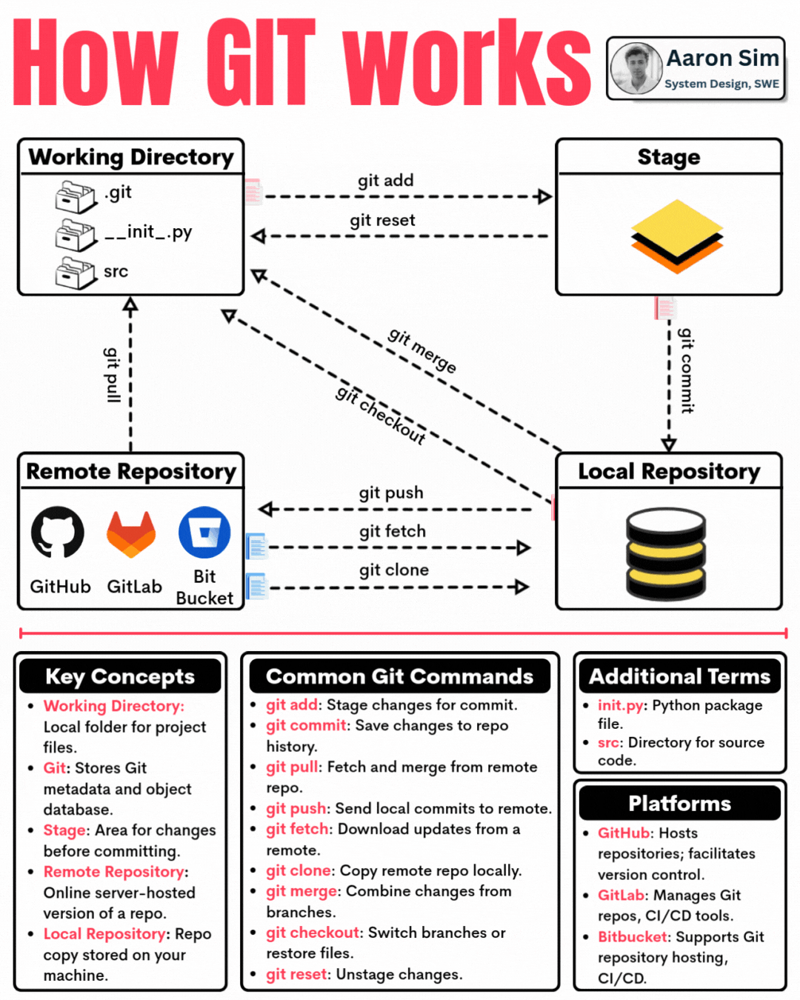

Git Basics

🔸 Working Directory
 → The local folder where your project files are stored and modified
🔸 .git Folder
 → Stores all metadata and the object database for your project
🔸 Stage (Staging Area)
 → Temporary space where you prepare changes before committing
🔸 Remote Repository
 → The cloud-hosted version of your repo, stored on platforms like GitHub, GitLab, or Bitbucket
🔸 Local Repository
 → A local copy of your repository on your machine

 

git push origin main

Git interprets it as:

push → Upload your commits
origin → To the remote repository named "origin"
main → Push the local main branch

So it means:

"Push my local main branch to the remote repository called origin."

Suppose you cloned a repository:

    git clone https://github.com/user/project.git

Git automatically creates a remote named origin:

    git remote -v

Output:

origin  https://github.com/user/project.git (fetch)
origin  https://github.com/user/project.git (push)

Now when you execute:
    git push origin main

Why "origin"?
It's simply the default name Git uses when you clone a repository. You can choose any name:

    git remote add github https://github.com/user/project.git

Then you could push using:

   ** git push github main**

Here github works exactly like origin.

Add a remote
git remote add origin https://github.com/user/project.git
Change remote URL
git remote set-url origin https://github.com/user/new-project.git
Remove a remote
git remote remove origin